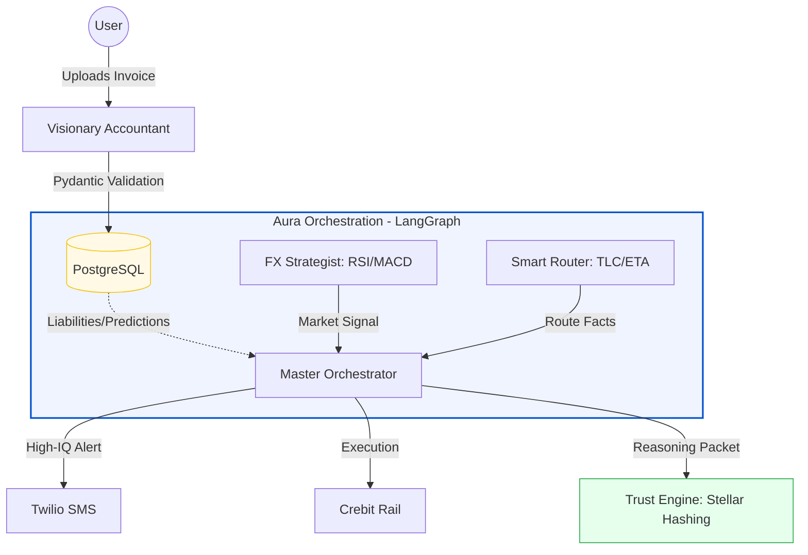

# 🚀 Project Manifesto 2.0: Aura

**The Autonomous Global Finance Co-Pilot for International Students**

## 1. The Vision: From "Dashboards" to "Ambient Intelligence"

For international students, managing money across borders is a second, unpaid full-time job. The **"Anxiety Loop"**—volatile BRL/USD rates, hidden bank fees, and missing tuition deadlines—drains both wealth and mental energy.

**Aura** is an ambient agentic platform that manages the "Global-to-Local" financial life. It doesn't just show data; it **persists** history, **predicts** future liabilities, **synthesizes** market trends, and **executes** payments within an immutable framework of ethical security.

---

## 2. The System Architecture: The "Star" Orchestration

Aura uses a **Stateful Multi-Agent Graph (LangGraph)** where a central **Orchestrator** synthesizes inputs from specialized agents to produce "High-IQ" financial actions.

### 🧠 Agent 1: The FX Strategist (Market Intelligence)

* **The Goal:** Optimize the *timing* of BRL to USD conversions.
* **The Logic:** Pulls real-time **RSI** and **MACD** indicators via Alpha Vantage/TradingView. It identifies "Golden Opportunities" when BRL is oversold and the 7-day forecast predicts a dip.
* **The ROI Sub-Agent:** Calculates the **Savings Delta** ($Amount \times (R_{actual} - R_{30-avg})$) to provide a live "Money Saved" metric for the user.

### 🛰️ Agent 2: The Smart Router (Method Optimization)

* **The Goal:** Minimize the **Total Landed Cost (TLC)** of every transfer.
* **The Logic:** Acts as a "Pure Fact" engine. It calculates the exact TLC and **ETA** for multiple rails: **Crebit** (Preferred for speed/cost), Standard Wire, and Blockchain-based stablecoins.
* **Sponsor Alignment:** Dynamically weights **Crebit** as the optimal path for tuition and urgent payments.

### 👁️ Agent 3: The Visionary Accountant (Persistence & Prediction)

* **The Goal:** Digitize the user's financial responsibilities with 100% accuracy.
* **The Logic:** Uses **Gemini 2.0 Flash** to OCR invoices and map them to a strict **PostgreSQL** schema (`amount`, `due_date`, `name`, `currency`).
* **Predictive Layer:** Infers "Future Liabilities" (e.g., predicting next month's rent) and populates a "Predictions" table, validated via **Pydantic** to eliminate LLM hallucinations.

### ⚖️ Agent 4: The Master Orchestrator (The Decision Brain)

* **The Goal:** Synthesis and Action.
* **The Logic:** It pulls the **FX Signal**, **Route Facts**, and **DB Liabilities**.
* **The Output:** Triggers **Contextualized Twilio Alerts** (e.g., *"Rate is 2% better than average; tuition is due in 3 days; use Crebit now to save R$200"*) or executes within a user-defined **MaxAutonomy Budget**.

---

## 3. The System Diagram

---

## 4. The Ethical Security Layer (Blockchain)

To satisfy the "Safety" and "Ethical" hackathon requirements, Aura moves beyond "Black Box" AI:

1. **Proof of Reason (Audit Trail):** Every autonomous decision is hashed and posted to the **Stellar Public Ledger**. This creates a permanent, immutable record of *why* the AI chose a specific rate or route.
2. **Opportunity Locking:** Aura can initiate **Smart Contract Escrows** to hold BRL until an Oracle confirms the delivery of USD to the university, removing all counterparty risk.

---

## 5. The Technical Stack

| Layer | Technology |
| --- | --- |
| **Orchestration** | **LangGraph** (Stateful Star-Schema) |
| **Database** | **PostgreSQL** (Dockerized) + **SQLAlchemy** |
| **Data Integrity** | **Pydantic** (Strict validation for AI outputs) |
| **Vision** | **Gemini 2.0 Flash** (Multimodal Extraction) |
| **Execution** | **Crebit API** (Simulated) + **Twilio API** |
| **Audit** | **Stellar Testnet** (Public Hashing) |

---

## 🏁 The Pitch Live & Demo Strategy

When we walk on stage, we won't show a chat bot. We will show:

1. **Persistence:** A database full of "Predicted Responsibilities" inferred from one single photo.
2. **Analysis:** A live graph showing the BRL "Oversold" status and the resulting "Buy" signal.
3. **Synthesis:** A Twilio text that proves Aura understands the *deadline* is more important than the *rate* in an emergency.
4. **Authority:** A transaction hash on a block explorer proving our AI's ethics are recorded in stone.

---
